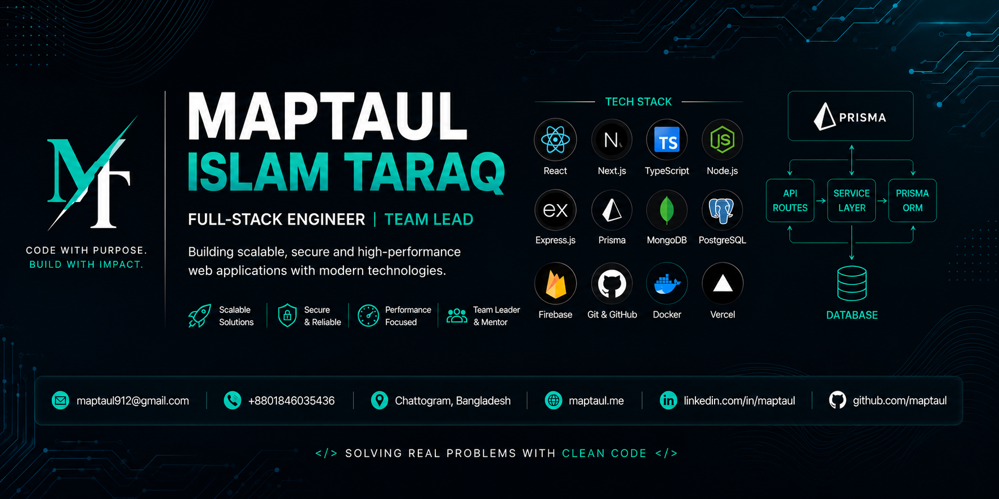

<!-- ════════════════════════ HERO BANNER ════════════════════════ -->


<!-- ════════════════════════ TYPING ANIMATION ════════════════════════ -->
<div align="center">

[](https://github.com/Maptaul)


<a href="https://maptaul.me"></a>

</div>


<!-- ════════════════════════ ABOUT ME ════════════════════════ -->
## 💡 About Me

```typescript
const maptaul = {
  role:      "Head of Technical Team @ WioCare 🏥",
  location:  "Chattogram, Bangladesh 🇧🇩",
  mission:   "Building AI-powered healthcare systems that improve lives",
  code:      ["JavaScript", "TypeScript"],
  stack:     ["Next.js", "React", "Node.js", "Express", "MongoDB", "PostgreSQL", "Prisma", "Firebase"],
  architecture: ["REST APIs", "MVC", "Repository Pattern", "Real-time Systems"],
  leading:   "Engineering team, system architecture & developer mentoring",
  offDuty:   ["coffee ☕", "cycling 🚴", "nature 🌿", "learning 📚"],
  motto:     "Code with purpose. Build with impact."
};
```

<br/>

<!-- ════════════════════════ CURRENT FOCUS ════════════════════════ -->
## 🚀 Current Focus

<div align="center">

| 🏥 | 🤖 | ⚡ | ☁️ | 🔐 | 📱 |
|:---:|:---:|:---:|:---:|:---:|:---:|
| **WioCare Healthcare Platform** | **AI in HealthTech** | **System Architecture** | **Cloud Deployment** | **Security & RBAC** | **Cross-Platform Apps** |

</div>


<!-- ════════════════════════ TECH STACK ════════════════════════ -->
## 🛠️ Tech Stack

<div align="center">

#### ⚛️ Frontend


#### ⚙️ Backend


#### ☁️ DevOps & Tools


</div>

<br/>

```text
JavaScript   ███████████████████░ 98%
TypeScript   ███████████████████░ 95%
React        ███████████████████░ 98%
Next.js      ███████████████████░ 95%
Node.js      ██████████████████░░ 92%
Express      ██████████████████░░ 90%
Firebase     ██████████████████░░ 90%
MongoDB      █████████████████░░░ 85%
Prisma       ████████████████░░░░ 80%
Docker       ████████████░░░░░░░░ 60%
```


<!-- ════════════════════════ ARCHITECTURE ════════════════════════ -->
## 🏗️ Architecture & Engineering

<div align="center">

`REST API` · `MVC` · `Repository Pattern` · `Service Layer` · `Prisma ORM` · `JWT Auth` · `RBAC` · `Socket.IO` · `Real-time Systems` · `Firebase Cloud Messaging` · `Payment Gateways (Stripe)` · `Background Jobs` · `Caching` · `Microservices-Ready Design`

</div>


<!-- ════════════════════════ FEATURED PROJECTS ════════════════════════ -->
## 🌟 Featured Projects

<div align="center">

| Project | Description | Tech |
|:---|:---|:---|
| 🏥 **[WioCare Platform](https://wiocare.com)** <br/>🌐 [wiocare.com](https://wiocare.com) · 🔒 *Production* | AI-powered digital healthcare ecosystem — ambulance dispatch with geo-tracking, pharmacy POS & delivery, lab booking with report automation, real-time notifications & payments | `Next.js` `React` `Express` `Firebase` `Socket.IO` `FCM` `Stripe` |
| 📚 **[LearnBridge](https://github.com/Maptaul/LearnBridge-client)** | Collaborative study platform connecting students, tutors & admins — [server repo](https://github.com/Maptaul/LearnBridge-server) | `React` `Node.js` `Express` `MongoDB` `JWT` |
| 🔧 **[FixItNow](https://github.com/Maptaul/FixItNow-Backend)** | Service-booking backend with clean modular architecture | `TypeScript` `Node.js` `Express` |
| 📊 **[DevPulse](https://github.com/Maptaul/DevPulse)** | Developer productivity & insights platform — [frontend](https://github.com/Maptaul/devpulse-frontend) | `TypeScript` `Next.js` |
| 🩸 **[BloodBank](https://github.com/Maptaul/bloodbank)** | Blood-donation platform with donor lists & request matching | `JavaScript` `React` |

<br/>

<a href="https://github.com/Maptaul?tab=repositories"></a>

</div>


<!-- ════════════════════════ GITHUB ANALYTICS ════════════════════════ -->
## 📊 GitHub Analytics

<div align="center">


<br/><br/>


<br/><br/>


<br/><br/>


</div>

<!-- ════════════════════════ CONTRIBUTION SNAKE ════════════════════════ -->
<div align="center">

<picture>
  <source media="(prefers-color-scheme: dark)" srcset="https://raw.githubusercontent.com/Maptaul/maptaul/output/github-contribution-grid-snake-dark.svg"/>
  <source media="(prefers-color-scheme: light)" srcset="https://raw.githubusercontent.com/Maptaul/maptaul/output/github-contribution-grid-snake.svg"/>
  
</picture>

</div>


<!-- ════════════════════════ TIMELINE ════════════════════════ -->
## 📅 Journey

<div align="center">

| Year | Milestone |
|:---:|:---|
| **2017** | 💻 Started programming |
| **2022** | 🖥️ Senior Computer Operator |
| **2025** | ⚛️ Frontend Developer |
| **2025** | 🚀 **Head of Technical Team @ WioCare** |
| **Today** | 🏥 Building AI-powered healthcare systems |

</div>

<!-- ════════════════════════ ACHIEVEMENTS ════════════════════════ -->
## 🏆 Achievements

- 👥 Leading the engineering team & software architecture at **WioCare**
- 🏥 Shipped a **production healthcare platform** — ambulance, pharmacy & lab modules
- 🔐 Built authentication systems with **JWT + role-based access control**
- 💳 Integrated **payment gateways** & real-time push notifications at scale
- 🤖 Delivering **AI features** into production healthcare workflows
- 🧑‍🏫 Mentoring developers & establishing engineering best practices


<!-- ════════════════════════ QUOTE ════════════════════════ -->
<div align="center">

### *"Technology should improve lives, not complicate them."*
**— Maptaul Islam Taraq**

</div>

<!-- ════════════════════════ CONNECT ════════════════════════ -->
## 🌐 Connect With Me

<div align="center">

<a href="https://maptaul.me"></a>
<a href="https://www.linkedin.com/in/maptaul/"></a>
<a href="mailto:maptaul912@gmail.com"></a>
<a href="https://wa.me/8801846035436"></a>
<a href="https://www.facebook.com/Maptaul/"></a>
<a href="https://github.com/Maptaul"></a>

<br/><br/>

⭐ *From [Maptaul](https://github.com/Maptaul) — if my work helps you, a star means a lot!*  

</div>

<!-- ════════════════════════ FOOTER ════════════════════════ -->

